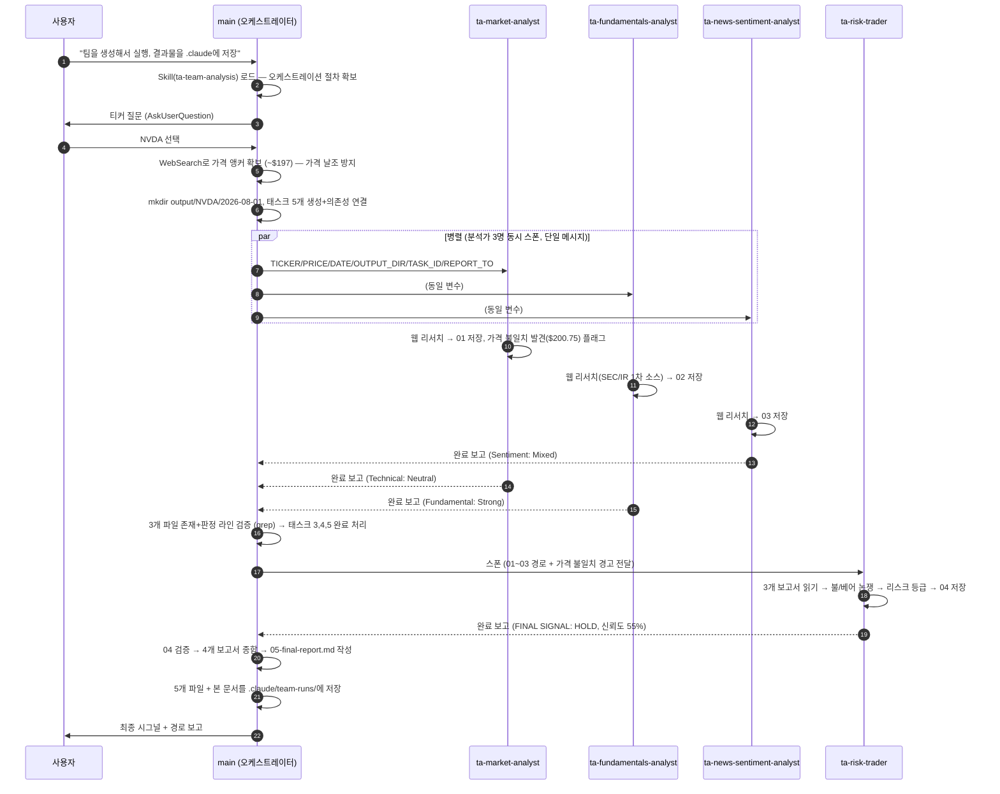
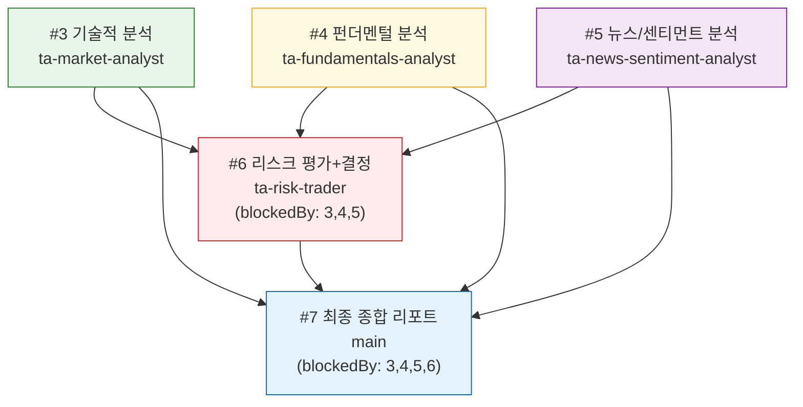

# 팀 실행 과정 문서 — NVDA 분석 (2026-08-01)

> **교육용 문서.** Claude Code 서브에이전트 팀이 NVDA 트레이딩 분석을 실제로 어떻게 수행했는지,
> 오케스트레이션의 각 단계·판단·검증을 이 실행(run) 그대로 기록한다.
> 결과 보고서 5개(`01`~`05`)는 이 디렉토리에 함께 있다.

---

## 1. 이 팀은 무엇인가

TradingAgents 레포에는 이름이 "분석"인 것이 두 가지 있고, 이번 실행은 그중 **런타임 리서치 팀**이다.

| | Python 파이프라인 | **런타임 리서치 팀 (이번 실행)** |
|---|---|---|
| 엔진 | `tradingagents/`의 12-에이전트 LangGraph | Claude Code 서브에이전트 4명 + 웹 검색 |
| 데이터 | yfinance / Alpha Vantage / FRED | 라이브 웹 페이지 |
| 시그널 | 5단계 `Buy/Overweight/Hold/Underweight/Sell` | `BUY/SELL/HOLD` |
| 필요조건 | 프로바이더 API 키, `pip install -e .` | 없음 (웹 검색만) |
| 비용 | LLM API 과금 | LLM API 과금 없음 |

두 출력은 **호환되지 않는다** — 이번 결과를 파이프라인 파서(`parse_rating`)에 넣으면 안 된다.

### 팀 구성 (역할 정의는 `.claude/agents/ta-*.md`)

```
main (오케스트레이터 = 이 세션)
├── ta-market-analyst          기술적 분석  → 01-technical-analysis.md
├── ta-fundamentals-analyst    펀더멘털     → 02-fundamentals-analysis.md
├── ta-news-sentiment-analyst  뉴스/센티먼트 → 03-news-sentiment-analysis.md
└── ta-risk-trader             리스크+결정  → 04-risk-trade-decision.md
    (05-final-report.md 는 오케스트레이터가 직접 작성)
```

**핵심 설계 원칙**: 각 에이전트의 "일하는 방법"(분석 요건, 증거 규율, 보고서 형식, 출력 프로토콜)은
전부 에이전트 정의 파일에 있다. 오케스트레이터는 **실행별 변수만** 전달한다
(티커, 가격, 날짜, 출력 경로, 태스크 ID, 보고 대상). 같은 지시를 두 군데 두면 서로 어긋나기 때문이다.
오케스트레이션 절차 자체는 `.claude/skills/ta-team-analysis/SKILL.md`가 단일 소스다.

---

## 2. 실행 플로우 다이어그램

### 2.1 순서도 (이번 실행 그대로)



### 2.2 의존성 그래프 (태스크 구조)



**왜 이 모양인가**: 분석가 3명은 서로의 출력을 읽지 않으므로 **병렬**이 안전하고 빠르다.
ta-risk-trader는 세 보고서를 디스크에서 읽어 종합하므로 **반드시 3명 완료 후** 실행한다
(입력이 없으면 거부하고 보고하도록 정의되어 있어, 조기 스폰은 실행 낭비가 된다).

---

## 3. 단계별 상세 기록 (이번 실행에서 실제로 일어난 일)

### 단계 0 — 입력 변수 수집

| 변수 | 값 | 어떻게 정했나 |
|---|---|---|
| `TICKER` | NVDA | 사용자에게 선택지 제시(AskUserQuestion), 사용자가 NVDA 선택 |
| `DATE` | 2026-08-01 | 오늘 날짜 기본값 |
| `PRICE` | ~$197 | 오케스트레이터가 WebSearch로 확보. **스킬 규칙: 모르면 "unknown"으로 전달, 절대 지어내지 않는다** — 날조된 앵커 가격은 하류의 모든 지지/저항·손익비 계산을 오염시킨다 |
| `OUTPUT_DIR` | `output/NVDA/2026-08-01` | `output/{TICKER}/{DATE}` 규칙 |

> 여기서 전달한 ~$197이 실제로는 7/30 세션 데이터였음이 나중에 밝혀진다(단계 3 참조).
> 팀의 증거 규율이 이 오염을 어떻게 자정했는지가 이 실행의 교육적 하이라이트다.

### 단계 1 — 태스크 생성과 의존성 배선

`TaskCreate`로 5개 태스크 생성 후 `TaskUpdate`로:
- 태스크 #6(리스크) ← `addBlockedBy: [3, 4, 5]`
- 태스크 #7(종합) ← `addBlockedBy: [3, 4, 5, 6]`
- 각 태스크 `owner`를 스폰할 에이전트 이름으로 지정

의존성을 태스크 시스템에 명시하면 오케스트레이터가 실수로 순서를 어겨도 시스템이 막는다.

### 단계 2 — 분석가 3명 병렬 스폰

**단일 메시지에 Agent 호출 3개**를 담아 동시 실행(순차 스폰하면 벽시계 시간 3배).
각 스폰 프롬프트는 아래 6줄이 전부다 — 에이전트 정의가 나머지 전부를 안다:

```
TICKER: NVDA
PRICE: ~$197 (last close 2026-07-31; intraday range 191.52–197.25)
DATE: 2026-08-01
OUTPUT_DIR: output/NVDA/2026-08-01
TASK_ID: 3            # 에이전트별로 3/4/5
REPORT_TO: main
```

각 에이전트는 정의된 출력 프로토콜대로: ① 보고서를 지정 경로에 `Write` →
② 자기 태스크를 `completed`로 갱신 → ③ 전문을 `REPORT_TO`(main)에 `SendMessage`.

### 단계 3 — 분석가들의 작업 (각자 독립적으로 한 일)

**ta-market-analyst (기술적)** — 7개 웹 소스에서 가격/지표를 수집했는데 소스들이 서로 불일치
(RSI 43 vs 59, MACD -0.16 vs -2.73, 50/200일 이평 상하관계까지 상충). 규율에 따라
**평균 내지 않고 전부 날짜와 함께 나열**하고, 모든 소스가 동의하는 정성적 판독만 결론에 사용했다.
디스패치 가격 ~$197이 7/30 데이터로 보인다는 것을 산술 검증($195.04 × 1.0293 = $200.75)으로
밝혀내 **오케스트레이터의 입력 오류를 플래그**했다. 판정: **Neutral** (모든 소스 불일치를 견디는 유일한 결론).

**ta-fundamentals-analyst (펀더멘털)** — 뉴스 대신 **1차 소스 우선**(NVIDIA IR 보도자료, SEC 8-K).
GAAP 순이익이 영업이익보다 큰 이상 신호를 잡아 원인($30.2B 상장주식 평가익)을 특정하고
non-GAAP EPS를 실질 수익력으로 제시했다. 포워드 P/E 불일치(16x vs 22.45x)는 평균 대신 범위로 유지.
판정: **Strong**.

**ta-news-sentiment-analyst (뉴스/센티먼트)** — 뉴스·애널리스트·리테일·내부자·기관 5개 축을
따로 수집해 **축 간 괴리 자체를 핵심 발견**으로 보고했다(셀사이드 만장일치 강세 vs 뉴스 약세 vs
리테일 급변동). 접근 차단(StockTwits HTTP 403)과 상충 데이터(볼륨 +21% vs -42%)를 숨기지 않고
Data Gaps에 기록. 판정: **Mixed**.

### 단계 4 — 오케스트레이터 검증 후 ta-risk-trader 투입

에이전트의 "완료했다"는 말은 주장이지 증거가 아니다. 스폰 전에:
```
ls output/NVDA/2026-08-01/          # 3개 파일 존재·비어있지 않음 확인
grep "## Technical Direction:\|## Fundamental Rating:\|## Sentiment Direction:" 0*.md
```
세 판정 라인이 모두 확인된 후에야 태스크 3/4/5를 완료 처리하고 ta-risk-trader를 스폰했다.
스폰 프롬프트에는 **기술 분석가가 발견한 가격 불일치를 명시적으로 인계**했다 — 하류 에이전트가
같은 함정에 다시 빠지지 않게 하는 것이 오케스트레이터의 일이다.

### 단계 5 — ta-risk-trader의 종합과 결정

세 보고서를 디스크에서 읽고: ① 3원 가격 불일치를 정면으로 다뤄 산술적으로 자기일관한 $200.75를
작업 기준으로 채택(단 "미해결"로 유지, 신뢰도 차감) → ② 불 케이스 6개 / 베어 케이스 5개 구축 →
③ 입력 간 충돌 5건을 명시적 가중 규칙으로 처리(1차 소스 > 내러티브, 상충 지표는 정성 판독만) →
④ 리스크 4범주 등급화 → ⑤ **손익비 산술로 결정**: 현재가 매수는 R/R ~1:1(코인플립)이라 BUY 불가,
3회 방어된 $194는 3.6:1 — 같은 논지라도 가격 위치가 베팅을 바꾼다.
판정: **HOLD, 신뢰도 55%** (방향이 아니라 증거 품질이 상한선을 그었다).

### 단계 6 — 오케스트레이터의 최종 종합

04 파일과 FINAL SIGNAL 라인 검증 → 4개 보고서를 모두 읽고 `05-final-report.md` 작성
(스킬의 고정 템플릿: 시그널 표, 에이전트별 결론 표, 4개 섹션 요약, 자체 종합, **Data Gaps는
비어도 반드시 유지** — 빈약한 분석이 완전해 보이는 것을 막는 장치, 모니터링 포인트, 출처, 면책).
마지막으로 5개 보고서 + 본 문서를 `.claude/team-runs/2026-08-01-NVDA/`에 저장.

---

## 4. 이번 실행의 교육 포인트

1. **날조 금지 규율이 실제로 작동했다.** 오케스트레이터가 넘긴 가격 앵커(~$197)가 하루 지난
   데이터였는데, 기술 분석가가 산술 검증으로 잡아냈고, 그 플래그가 리스크 트레이더까지 전파되어
   최종 신뢰도(55%)에 반영됐다. 팀 설계의 요체는 "각자 잘하는 것"이 아니라 **오류가 전파되다가
   교정되는 경로**다.
2. **불일치는 평균 내지 않는다.** RSI 43 vs 59를 평균해 51이라고 쓰면 그럴듯하지만 거짓이다.
   팀 전체가 "출처+날짜와 함께 나열, 모두가 동의하는 것만 결론에 사용" 규율을 지켰다.
3. **판정 어휘가 계약이다.** 각 보고서는 고정된 판정 라인(`## Technical Direction:` 등)으로
   끝나야 하고, 오케스트레이터는 이 라인을 grep으로 검증한 뒤에만 다음 단계로 간다.
   자연어 보고서 사이에 기계적으로 검증 가능한 인터페이스를 심어둔 것.
4. **병렬과 순차의 경계는 데이터 의존성이다.** 서로 읽지 않는 3명은 병렬, 셋을 읽는 1명은 순차.
   "개념적으로 단계가 다르다"가 아니라 "누가 누구의 출력을 읽는가"로 결정한다.
5. **검증은 파일로 한다.** "완료했습니다"라는 에이전트 메시지가 아니라 디스크의 파일 존재·내용·
   판정 라인이 완료의 증거다.
6. **Data Gaps는 기능이다.** 네 보고서 모두 못 구한 것(베타, 평균 거래량, 고객 집중도…)을
   명시했고, 그것이 그대로 "왜 Strong 펀더멘털이 55% HOLD에 그치는가"의 답이 됐다.

## 5. 재현 방법

```
# 1. 오케스트레이션 절차 로드
Skill(ta-team-analysis)

# 2. 변수 수집: TICKER, DATE(기본 오늘), PRICE(웹 확인, 모르면 "unknown")
# 3. mkdir -p output/{TICKER}/{DATE}
# 4. TaskCreate x5 → TaskUpdate로 의존성(4번째는 1-3에, 5번째는 1-4에 블록) + owner 지정
# 5. 단일 메시지로 분석가 3명 Agent 스폰 (위 6줄 디스패치 변수만 전달)
# 6. 완료 알림 후 파일+판정 라인 검증 → ta-risk-trader 스폰
# 7. 04 검증 → 05-final-report.md 작성 → 태스크 완료 처리
```

## 6. 이 실행의 산출물

| 파일 | 작성자 | 판정 |
|---|---|---|
| `01-technical-analysis.md` | ta-market-analyst | Technical Direction: **Neutral** |
| `02-fundamentals-analysis.md` | ta-fundamentals-analyst | Fundamental Rating: **Strong** |
| `03-news-sentiment-analysis.md` | ta-news-sentiment-analyst | Sentiment Direction: **Mixed** |
| `04-risk-trade-decision.md` | ta-risk-trader | FINAL SIGNAL: **HOLD** (55%) |
| `05-final-report.md` | main (오케스트레이터) | 종합 |
| `EXECUTION-FLOW.md` | main (오케스트레이터) | 본 문서 |

원본은 `output/NVDA/2026-08-01/`에, 사본과 본 문서는 `.claude/team-runs/2026-08-01-NVDA/`에 있다.

> **면책**: 산출물 전체는 공개 웹 기반 AI 리서치이며 투자 자문이 아니다.
