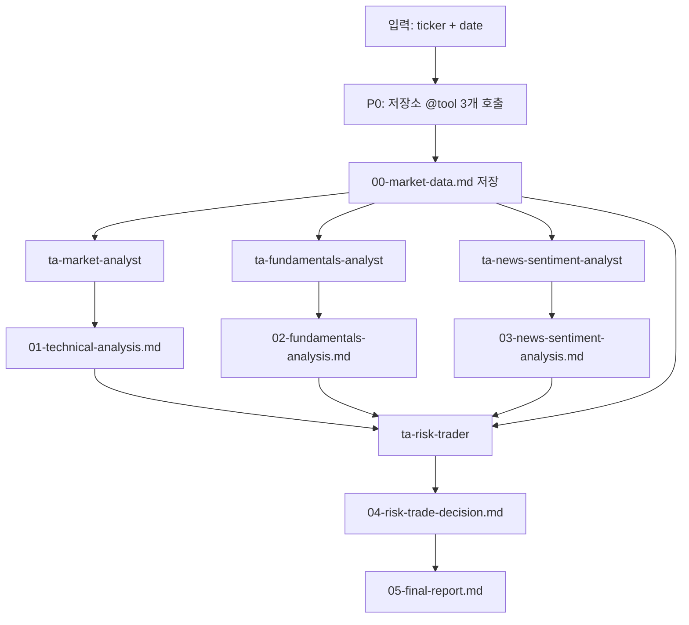

# 13장: Claude Code 트레이딩 워크플로우

이 장은 현재 `.claude/workflows/`에 남아 있는 트레이딩 실행 워크플로를 설명한다.
워크플로는 팀 목록이 아니라 **언제 어떤 순서로 파일을 만들고, 어떤 증거를 다음 단계에
넘기는가**를 정한 control plane이다.

현재 워크플로는 두 개다.

| Workflow | 용도 | 산출물 |
|---|---|---|
| `ta-team-run.js` | 단일 종목 분석 | `.claude/team-runs/{DATE}-{TICKER}/00`~`05` |
| `ta-watchlist-run.js` | 여러 종목을 같은 날짜 기준으로 비교 | `.claude/team-runs/{DATE}-watchlist/00-watchlist-summary.md` |

## 핵심 흐름



이 흐름에서 가장 중요한 파일은 `00-market-data.md`다. 이 파일이 없으면 각 에이전트가
웹에서 서로 다른 기준가를 가져올 수 있다. 그래서 워크플로는 먼저 P0를 실행해 가격 앵커와
지표를 고정한다.

## 단일 종목 실행

단일 종목은 다음 형태로 호출한다.

```text
Workflow(name: "ta-team-run",
         args: {ticker: "NVDA", date: "2026-08-01"})
```

`date`는 필수다. 워크플로 안에서 오늘 날짜를 추측하지 않는다. 장 마감 후 분석인지,
주말 분석인지, 과거 리플레이인지에 따라 source of truth가 달라지기 때문이다.

실행 단계는 다음과 같다.

| 단계 | 하는 일 | 실패 시 처리 |
|---|---|---|
| P0 | `repo_market_data.py`로 저장소 `@tool` 호출 | 실패하면 web-only degraded run으로 표시 |
| Analysts | 세 애널리스트 병렬 실행 | 파일 저장 여부를 확인 |
| Risk | `00`~`03`을 읽고 최종 시그널 결정 | 입력 파일 누락 시 진행하지 않음 |
| Final | `05-final-report.md` 작성 | Run boundary와 Data Gaps 포함 |

P0가 호출하는 툴은 제품 market analyst가 쓰는 것과 같은 저장소 `@tool`이다.
따라서 가격·지표 계산은 Claude가 하지 않는다. Claude는 계산 결과를 해석한다.

## 워치리스트 실행

워치리스트는 여러 종목을 같은 날짜 기준으로 비교할 때 사용한다.

```text
Workflow(name: "ta-watchlist-run",
         args: {tickers: ["NVDA", "AMD", "AVGO"], date: "2026-08-01"})
```

각 종목은 독립적인 `ta-team-run`으로 처리된다. 그 뒤 각 종목의 `05-final-report.md`를 읽어
요약 랭킹을 만든다. 종목마다 에이전트가 여러 개 돌기 때문에 한 번에 2~3종목을 권장한다.

워치리스트 요약은 새 리서치를 하지 않는다. 이미 만들어진 종목별 최종 리포트만 읽는다.
이 제한이 있어야 종목 A와 종목 B의 비교 기준이 런마다 흔들리지 않는다.

## 파일 계약

모든 산출물은 `.claude/team-runs/` 아래에만 저장한다.

```text
.claude/team-runs/{DATE}-{TICKER}/
├── 00-market-data.md
├── 01-technical-analysis.md
├── 02-fundamentals-analysis.md
├── 03-news-sentiment-analysis.md
├── 04-risk-trade-decision.md
└── 05-final-report.md
```

이전 방식의 `output/{TICKER}/{DATE}/`는 현재 팀 계약의 저장 위치가 아니다.
공개 페이지와 교육 자료도 `.claude/team-runs/`를 기준으로 읽어야 한다.

## 검증 포인트

워크플로가 성공했다고 말하려면 최소한 다음을 확인해야 한다.

1. `00-market-data.md`에 세 tool section이 있다.
2. `00`의 verified close와 기준일이 모든 리포트에 같은 값으로 전파됐다.
3. `01`의 기술 지표 수치가 `00`과 맞다.
4. `04`에 `FINAL SIGNAL: BUY/SELL/HOLD`, entry, target, stop, confidence가 있다.
5. `05`에 Repo-Tool Market Data, Data Gaps, Run boundary가 있다.
6. 웹 출처와 저장소 툴이 충돌하면 평균내지 않고 mismatch로 기록했다.

최신 `2026-08-02-NVDA` 런은 이 계약을 더 강하게 드러낸다. `00-market-data.md`가 추가되면서
verified close `$200.75`, RSI `48.31`, 50일 SMA `206.12`가 모든 리포트의 기준이 됐다.
최종 결론은 `HOLD / 62%`다.

## 제품 파이프라인과 섞지 않기

`ta-team-run`은 `tradingagents analyze`가 아니다. 제품 파이프라인은 LangGraph state,
tool loop, memory, 5단계 rating parser를 가진다. Claude 워크플로는 교육용 팀 실행 기록과
마크다운 리포트를 만든다.

두 실행의 접점은 P0의 저장소 `@tool`이다. 이 접점은 유용하다. 같은 시장 데이터 계산을 쓰기
때문에 숫자의 기준은 흔들리지 않는다. 그러나 해석 결과와 신호 어휘는 서로 다른 산출물이다.

## Education Shell에서 가르칠 포인트

이 워크플로는 “에이전트를 많이 만들면 팀이 된다”는 예가 아니다. 팀이 되려면 다음 조건이
필요하다는 예다.

| 강의 포인트 | 이 워크플로에서 보이는 구현 |
|---|---|
| 데이터 앵커 | P0가 `00-market-data.md`를 먼저 만든다. |
| 병렬과 순차의 분리 | 세 애널리스트는 병렬, risk trader는 순차다. |
| 파일 기반 증거 | 에이전트의 일반 텍스트 답변이 아니라 디스크 산출물이 다음 단계 입력이다. |
| 손실 방지 | 웹 값이 저장소 툴과 다르면 mismatch로 기록한다. |
| 경계 문구 | 최종 리포트가 투자 자문이나 제품 파이프라인 출력이 아님을 명시한다. |

## 핵심 정리

`ta-team-run`과 `ta-watchlist-run`은 Claude Code 팀 위에 놓인 트레이딩 실행 control plane이다.
가장 중요한 결정은 P0를 먼저 두는 것이다. 숫자는 저장소가 계산하고, Claude 팀은 그 숫자를
해석한다. 이 순서를 지켜야 교육용 팀런이 단순 웹 리포트가 아니라 재검토 가능한 실행 기록이 된다.

## 원본 자료

- [`.claude/workflows/README.md`](https://github.com/nfbs2000/speaky-TradingAgents/blob/main/.claude/workflows/README.md)
- [`.claude/workflows/ta-team-run.js`](https://github.com/nfbs2000/speaky-TradingAgents/blob/main/.claude/workflows/ta-team-run.js)
- [`.claude/workflows/ta-watchlist-run.js`](https://github.com/nfbs2000/speaky-TradingAgents/blob/main/.claude/workflows/ta-watchlist-run.js)
- [`.claude/skills/ta-team-analysis/SKILL.md`](https://github.com/nfbs2000/speaky-TradingAgents/blob/main/.claude/skills/ta-team-analysis/SKILL.md)
