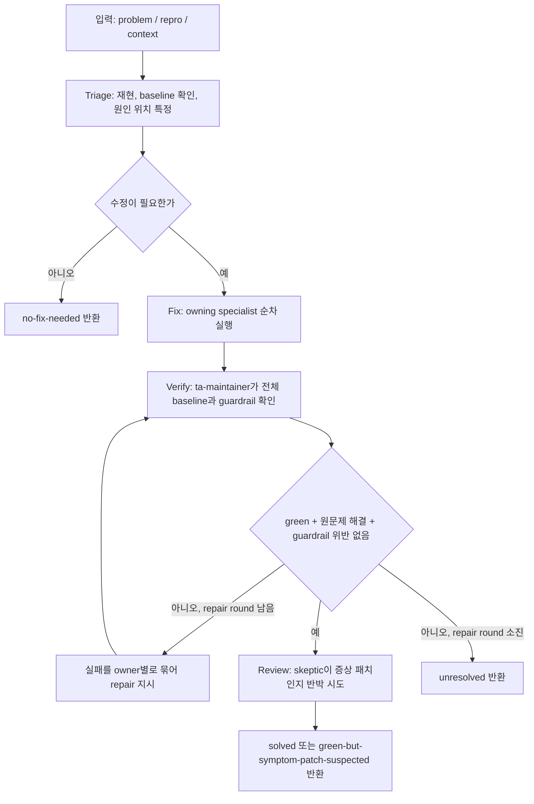

# 13장: Claude Code 워크플로우

이 장은 새로 추가된 `.claude/workflows/ta-problem-solver.js`를 강의용으로 해석한다.

12장이 “어떤 Claude Code agent와 skill이 있는가”를 설명했다면, 이 장은 그 agent들을
**어떤 순서로 부르고, 어떤 증거를 넘기고, 언제 다시 고치게 할지**를 설명한다. 즉
워크플로우는 팀 목록이 아니라 실행 절차다.

<div class="truth-note">
<strong>핵심 구분</strong>
TradingAgents Python 파이프라인은 금융 분석 제품 코드다. `.claude/agents`는 그 코드를
고치기 위한 작업자 정의고, `.claude/skills`는 작업자가 읽는 검증된 지식이다.
`.claude/workflows`는 작업자와 지식을 묶어서 반복 가능한 운영 절차로 만든다.
</div>

## 어디에 놓이는가

| 층 | 파일 | 질문 |
|---|---|---|
| 제품 파이프라인 | `tradingagents/` | 금융 분석 실행은 실제로 어떻게 흘러가는가 |
| 팀 정의 | `.claude/agents/*.md` | 어떤 specialist가 어떤 파일을 맡는가 |
| 지식 원장 | `.claude/skills/*/SKILL.md` | agent가 작업 전에 읽어야 하는 검증된 사실은 무엇인가 |
| 실행 절차 | `.claude/workflows/ta-problem-solver.js` | 문제 하나를 어떤 단계로 재현, 수정, 검증, 리뷰할 것인가 |

따라서 이 워크플로우는 TradingAgents의 투자 판단 엔진이 아니다. 이 포크를 고치고
검증하기 위한 **Education Shell 강의용 운영층**이다.

## 호출 형태

문제 해결 워크플로우는 다음 형태로 부른다.

```text
Workflow(name: "ta-problem-solver",
         args: {problem: "<무엇이 깨졌는가>", repro: "<선택: 재현 명령>"})
```

`problem`은 필수다. 문자열로 넘기면 `{ problem: "..." }`로 정규화하고, 객체로 넘기면
`problem`, `repro`, `context`를 읽는다. `problem`이 없으면 바로 실패한다. 강의 관점에서
이 부분은 “좋은 자동화는 애매한 입력을 조용히 추측하지 않는다”는 예다.

## 전체 흐름



워크플로우의 기본 반복 한계는 `MAX_REPAIR_ROUNDS = 2`다. 첫 triage/fix 뒤 검증하고,
실패하면 최대 두 번까지 owner별 repair를 돌린다. 무한히 고치게 하지 않는 이유는 자동화가
repo 상태를 더 망가뜨릴 수 있기 때문이다.

## Phase 1: Triage

Triage agent는 문제를 바로 고치지 않는다. 먼저 증거를 만든다.

1. 보고된 `repro`가 있으면 실행한다.
2. 없으면 가장 좁은 pytest, import, CLI 호출로 문제를 드러내려 한다.
3. paid LLM pipeline이나 backtest sweep에서만 나는 문제라면 비용 실행을 하지 않고 코드와
   테스트에서 판단한다.
4. 현재 suite baseline이 이미 깨져 있는지 확인한다.
5. 실패 경로를 읽고 파일과 함수 단위로 원인 가설을 적는다.
6. 바꿔야 할 파일의 ownership에 따라 specialist 작업 목록을 만든다.

Triage의 출력은 자유문이 아니라 schema다.

| 필드 | 의미 |
|---|---|
| `reproduced` | 실제 재현 또는 증거 확인 여부 |
| `repro_command` | 문제를 드러낸 명령 |
| `evidence` | 실제 에러, 실패 assertion, 잘못된 동작 |
| `diagnosis` | 어느 파일/함수가 왜 틀렸는가 |
| `fix_needed` | 코드 수정이 필요한가 |
| `plan` | owner별 수정 작업 목록 |

강의에서 중요한 점은 여기다. 워크플로우는 “똑똑한 agent에게 알아서 고쳐”가 아니라,
**재현 가능한 증거를 먼저 만들고 그 증거를 다음 phase의 계약으로 넘긴다.**

## 라우팅 기준

라우팅은 주제어가 아니라 **변경해야 하는 artifact**로 한다.

| 변경 대상 | owner |
|---|---|
| prompt, system message, `agents/schemas.py`, 새 agent | `ta-agent-smith` |
| `graph/setup.py`, routing, node name, path map, checkpoint | `ta-graph-engineer` |
| `agents/utils/*_tools.py`, `dataflows/`, vendor, indicator | `ta-data-engineer` |
| `llm_clients/`, provider, model config, provider kwargs | `ta-llm-engineer` |
| `memory.py`, `reflection.py`, `trading_memory.md` | `ta-memory-engineer` |
| run 결과 해석, config 비교, `full_states_log_*.json` | `ta-evaluator` |
| upstream merge fallout, baseline drift, skill drift | `ta-maintainer` |

이 라우팅이 필요한 이유는 TradingAgents가 한 파일만 바꾸면 끝나는 구조가 아니기 때문이다.
예를 들어 새 tool을 추가할 때는 순서가 있다.

```text
ta-data-engineer: tool이 존재하고 route된다
→ ta-graph-engineer: ToolNode에 binding된다
→ ta-agent-smith: prompt가 그 tool을 언급한다
```

prompt가 먼저 tool을 말하면 agent는 존재하지 않는 능력을 가진 척한다. graph binding이
먼저 들어가면 runtime에서 빠진 tool을 호출하려 한다. 그래서 워크플로우는 ownership 순서를
문서가 아니라 실행 절차 안에 넣는다.

## Phase 2: Fix

Fix phase는 specialist들을 병렬로 던지지 않는다. Triage가 만든 `plan` 순서대로 하나씩
부른다.

각 specialist는 다음 정보를 받는다.

| 입력 | 목적 |
|---|---|
| 원래 문제 | 사용자가 실제로 말한 고장 |
| root-cause diagnosis | symptom이 아니라 mechanism을 고치게 하는 기준 |
| evidence | 실패를 재현한 실제 출력 |
| repro command | 수정 뒤 다시 돌릴 최소 확인 |
| 자기 task | 만질 파일, 바꿀 내용, acceptance check, 금지 영역 |
| prior reports | 앞 owner가 이미 바꾼 내용 |
| environment contract | `python3`, 설치, test baseline, paid run 금지 |
| fork guardrails | 이 포크에서 존재하지 않는 API나 잘못된 vocabulary 차단 |

Fix 결과도 schema로 제한된다.

| 필드 | 의미 |
|---|---|
| `done` | 자기 task를 끝냈는가 |
| `summary` | 무엇을 왜 바꿨는가 |
| `changed_files` | 실제 변경 파일 |
| `concerns` | 남은 불확실성 |

이 구조 덕분에 다음 specialist와 verifier가 앞 작업을 추측하지 않고 읽을 수 있다.

## Phase 3: Verify

Verify phase는 `ta-maintainer`가 맡는다. 이 phase는 “agent가 고쳤다고 말했다”를 믿지 않는다.

검증 절차는 명시돼 있다.

1. `git diff`를 직접 읽는다.
2. 원래 repro가 있으면 다시 실행한다.
3. `pytest -q` 전체 suite를 돌린다.
4. `ruff check .`가 깨끗한지 확인한다.
5. diff를 fork guardrail 목록에 대조한다.
6. 남은 실패마다 suspected owner를 지정한다.

green 판정은 느슨하지 않다. 기대 baseline은 `576 passed, 2 skipped`이고, 새 테스트가
합법적으로 추가됐다면 그 증가분을 명시해야 한다. `ruff_clean`, `problem_resolved`,
`guardrail_violations`도 함께 본다.

검증이 실패하면 워크플로우는 실패를 owner별로 묶는다.

```text
실패 A → ta-data-engineer
실패 B → ta-graph-engineer
guardrail 위반 → 첫 plan owner 또는 maintainer
원문제 미해결 → 첫 plan owner
```

그 다음 각 owner에게 repair task를 다시 준다. 이 repair도 “테스트를 약하게 만들지 말고
root cause만 고쳐라”는 조건을 갖는다.

## Phase 4: Review

Review phase는 검증이 green일 때만 돈다. 역할은 칭찬이 아니라 반박이다.

검토 agent는 다음 질문을 한다.

- diff가 diagnosis의 mechanism을 고쳤는가, 아니면 보이는 증상만 숨겼는가
- 같은 root cause가 다른 경로로 다시 나타날 수 있는가
- test가 약해지거나 skip되거나 삭제됐는가
- fork guardrail과 모순되는가

이 phase 때문에 최종 outcome은 단순히 `solved`만이 아니다. 테스트가 green이어도 review가
root cause를 의심하면 `green-but-symptom-patch-suspected`가 될 수 있다. 강의에서 이 값은
중요하다. 자동화의 성공 기준이 “초록색 출력”보다 더 넓다는 뜻이기 때문이다.

## 환경 계약과 금지선

워크플로우는 agent에게 반복해서 같은 환경 계약을 넣는다.

| 계약 | 이유 |
|---|---|
| `python3` 사용 | 이 머신에 `python` shim이 없다는 운영 사실을 고정 |
| 필요하면 `pip install -e ".[dev]"` | import 실패를 코드 문제로 오진하지 않기 |
| baseline은 `576 passed, 2 skipped` | 부분 테스트 green을 전체 안정성으로 포장하지 않기 |
| paid LLM pipeline/backtest sweep 금지 | 비용과 외부 API side effect를 막기 |
| `.claude/skills/**` 수정 금지 | 사실 원장이 drift됐으면 보고하고, feature fix 중 조용히 고치지 않기 |
| commit/push 금지 | workflow는 working tree 수정까지만 맡고 최종 형상 관리는 사람이 한다 |

Fork guardrail도 별도로 있다. 예를 들어 이 포크에는 `FinancialSituationMemory`,
`BM25`, `reflect_and_remember()` 같은 개념이 없고, pipeline signal은 `BUY/SELL/HOLD`가
아니라 `Buy/Overweight/Hold/Underweight/Sell` 5-tier vocabulary다. 이런 guardrail은
LLM이 upstream 문서나 일반 기억을 섞어 잘못된 코드를 만들지 못하게 막는다.

## Education Shell에서 가르칠 포인트

이 워크플로우는 Education Shell 강의에서 “agent orchestration”을 설명하기 좋은 예다.

| 강의 포인트 | 이 파일에서 보이는 구현 |
|---|---|
| 워크플로우는 prompt 모음이 아니다 | `phase()`, `agent()`, schema, loop, return object가 있는 실행 코드 |
| agent는 자유롭게 떠도는 존재가 아니다 | owner table과 phase label로 호출 지점이 제한된다 |
| evidence가 phase 사이를 이동한다 | triage의 `evidence`와 `diagnosis`가 fix, verify, review로 계속 전달된다 |
| 병렬보다 순서가 중요할 때가 있다 | data tool → graph binding → prompt 언급 순서를 강제한다 |
| 검증은 별도 역할이어야 한다 | 수정한 specialist가 아니라 `ta-maintainer`가 full baseline을 본다 |
| 자동 repair에는 한계가 있어야 한다 | `MAX_REPAIR_ROUNDS = 2`로 무한 수정 루프를 차단한다 |
| green도 충분하지 않을 수 있다 | skeptic review가 symptom patch를 따로 판정한다 |

한 문장으로 줄이면 이렇다. **워크플로우는 agent 팀 위에 놓인 control plane이다.** 팀은
누가 있는지 말하고, workflow는 언제 누구를 부를지와 어떤 증거를 다음 단계로 넘길지를
정한다.

## 학생에게 보여줄 최소 예제

강의에서는 거대한 버그를 바로 맡기기보다 작은 문제를 넣어 흐름을 관찰하는 편이 좋다.

```text
Workflow(name: "ta-problem-solver",
         args: {
           problem: "A targeted test fails after changing provider kwargs",
           repro: "pytest tests/test_llm_provider_kwargs.py -q",
           context: "Do not run live provider calls"
         })
```

관찰할 것은 최종 답변만이 아니다.

1. Triage가 실제로 repro를 잡았는가
2. owner가 artifact 기준으로 맞게 배정됐는가
3. Fix agent가 자기 skill을 먼저 읽었는가
4. Verify가 full baseline과 ruff를 따로 봤는가
5. 실패 시 repair가 원래 owner에게 돌아갔는가
6. Review가 green 결과를 다시 의심했는가

이 여섯 가지가 보이면 학생은 “agent를 많이 만들면 자동으로 팀이 된다”는 오해를 버리고,
상태, 계약, 라우팅, 검증이 있어야 팀이 된다는 점을 배운다.

## 핵심 정리

`ta-problem-solver`는 TradingAgents 제품 파이프라인이 아니다. 이 포크를 고치기 위한
Claude Code 운영 워크플로우다. 하지만 강의 가치는 크다. 문제 해결을 `Triage → Fix →
Verify → Review` 상태 기계로 만들고, 각 phase 사이를 schema와 evidence로 연결하기
때문이다.

이 장을 읽은 뒤 12장을 다시 보면 `.claude/agents`와 `.claude/skills`의 의미가 더
분명해진다. agent와 skill은 재료이고, workflow는 그 재료를 실제 작업 순서로 묶는
실행 계획이다.

## 원본 자료

- [`.claude/workflows/ta-problem-solver.js`](https://github.com/nfbs2000/speaky-TradingAgents/blob/main/.claude/workflows/ta-problem-solver.js)
- [`.claude/TEAM.md`](https://github.com/nfbs2000/speaky-TradingAgents/blob/main/.claude/TEAM.md)
- [12장: Claude Code 팀과 스킬](ch12-claude-team-skills.md)
